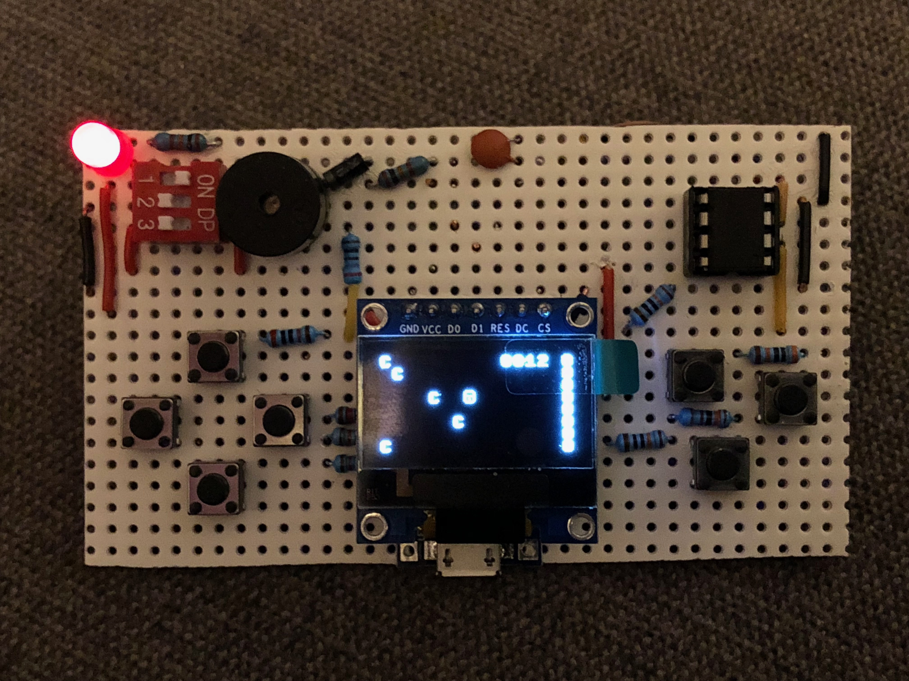
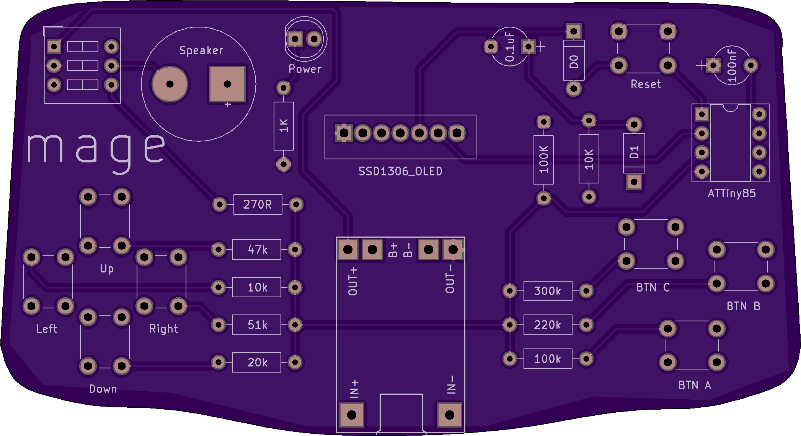
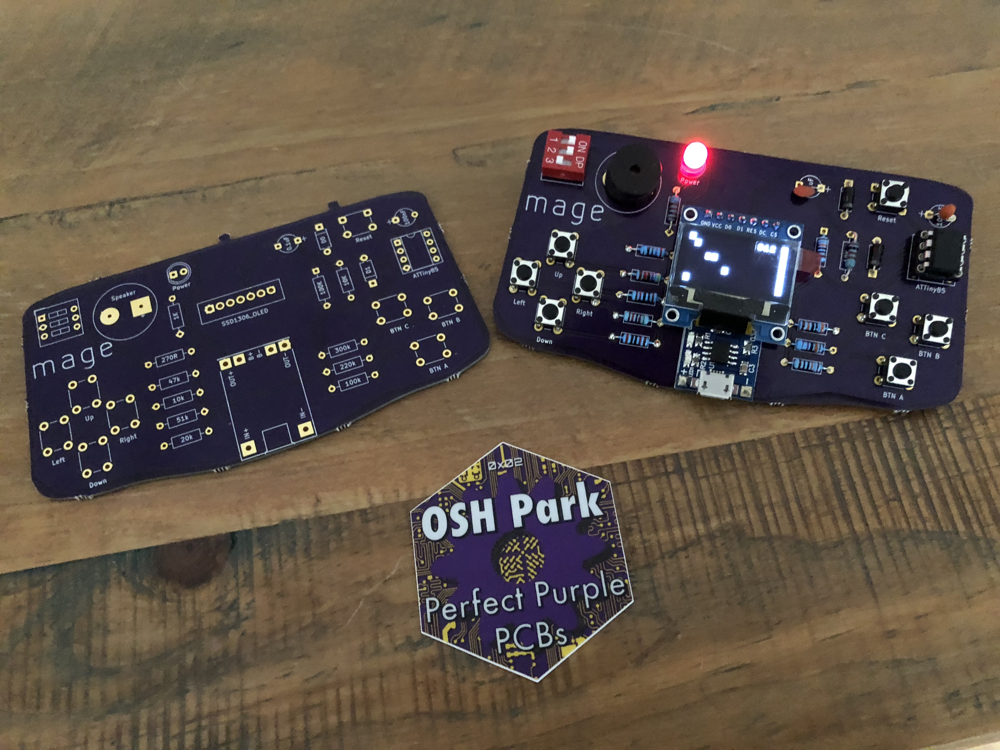
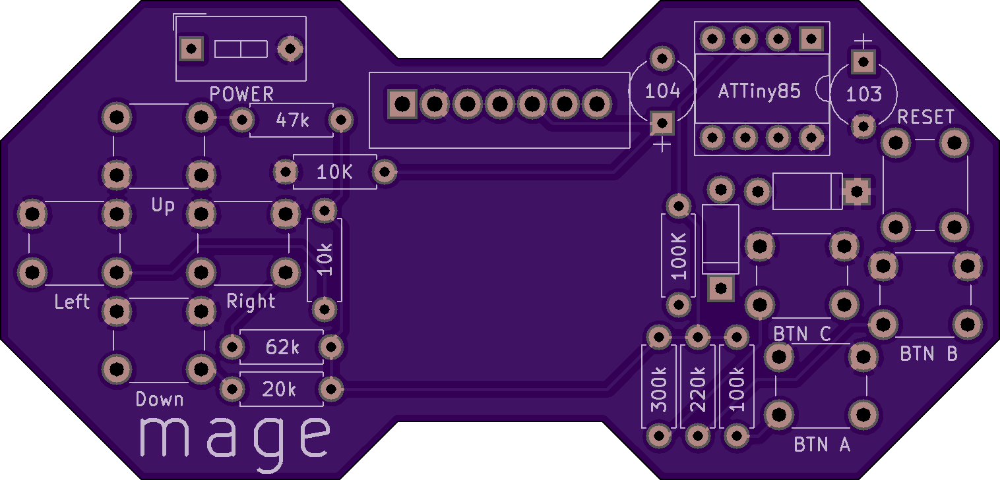

# Mage

Mage is my handheld ATTiny85 gaming project.

I've had this project bouncing around in my head for probably about 3 years now. 
Initially, I wasn't sure I could get an ATTiny85 to drive an OLED, but then a little
while ago I worked out how I could use a set of 8x8 tiles and an index map to keep
the SRAM requirements down.

After some furious breadboarding I produced a simple prototype which I transferred to protoboard

This turned out to be an immensely frustrating exercise. I *thought* I would be happy with
a simple little protoboard device that I could make a little case for with acrylic or my 3D
printer. I was wrong - this thing only worked for about 30 seconds at a time before one
connection or other wobbled and broke. The screen was really flaky and I nearly got put off
entirely.

Enter KiCAD - I vaguely remembered a [Hackaday series on making a PCB in everything](https://hackaday.com/2016/11/17/creating-a-pcb-in-everything-kicad-part-1/).
I downloaded KiCAD and promptly wept for a few days. The learning curve on creating a PCB, not just from
scratch, but with absolutely no idea how to even use the software was **steep**. But after a few days, I
took another stab and came up with something not half bad. In the end, one of the hardest parts was getting
a board outline imported from a vector app - I used a photo of a GameBoy Advance and drew around it!

I sent the files off to OSH Park and waited. 

I was so very pleased with what I'd created, I immediately set off to create a demo game - that's the
game contained in this repository. My ambitions grew a little faster than my knowledge of C and I've
almost squeezed as much as possible out of the ATTiny85, which is quite satisfying.

The board itself wasn't quite what I had imagined way back when I first had the idea - I'd seen things like
the Gamebuino, which are really neat (and small). So I fired up KiCAD again and had another crack.

The second revision was much smaller - I used OpenSCAD to design the outline (3 octagons and a rectangle), 
which imported straight into KiCAD without any issue. The whole thing is smaller and I decided to use a
CR2032 cell to power it, instead of the 3.7v Lipo & charger that I originally put on the board.

There were a few small issues, my first effort at soldering one nuked some of the traces and it took me a
while to realise what had caused the problems. I also discovered that the springiness of the battery clip
was too much for the small solder pads I'd defined and the battery clip pinged off taking the copper pad
with it!

I'm not entirely sure why it still works, but after a bit of hot glue action, the board was working again!
I wasn't happy with the layout - the screen overlapped awkwardly and the CR2023 was nice, but didn't actually
make it any thinner or smaller than a Lipo, so I returned to the drawing board and produced a *Final Version*
for which I am currently awaiting delivery.

